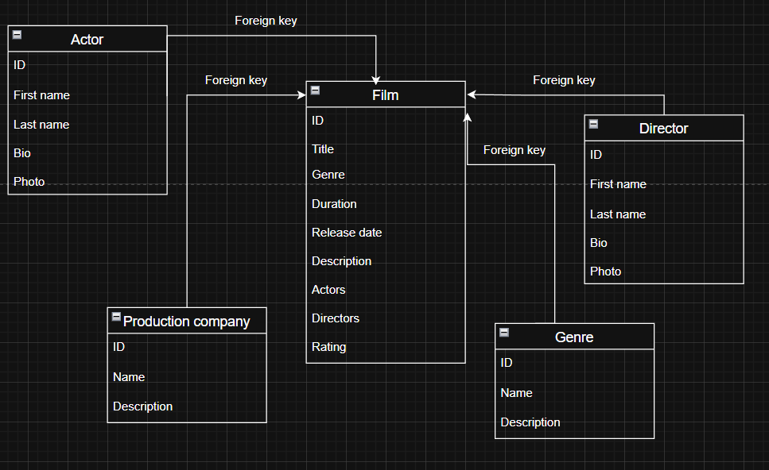

# FilmStory 


## Project idea / Short description

FilmStory is a site for films and all about them. Here you can read and add information about films. Also, you can get details about your favorite films — actors who appeared in the film, directors, genres, and other related information.

---

## Home

* `GET /api/`

  * Short usage: returns short site information for the home page (site name, short description, contact info).
  * Request: none.
  * Response: `200 OK`

    ```json
    {"site": "FilmStory", "description": "Browse and preview films.", "contact": {"email": "info@filmstory.example"}}
    ```

---

## Films

* `GET /api/films/`

  * Short usage: list films with basic fields (id, title, release_date, poster_url, rating).
  * Response: `200 OK`

    ```json
    {
      "results": [
        {"id": 1, "title": "Inception", "release_date": "2010-07-16", "poster_url": "https://...", "rating": 4.8},
        {"id": 2, "title": "The Matrix", "release_date": "1999-03-31", "poster_url": "https://...", "rating": 4.7}
      ]
    }
    ```

* `GET /api/films/{id}/`

  * Short usage: get detailed information for a single film.
  * Request: path param `id`.
  * Response: `200 OK`

    ```json
    {
      "id": 1,
      "title": "Inception",
      "description": "A mind-bending thriller...",
      "release_date": "2010-07-16",
      "runtime_minutes": 148,
      "poster_url": "https://...",
      "trailer_url": "https://...",
      "genres": [{"id":1, "name":"Sci-Fi"}],
      "actors": [{"id":5, "name":"Leonardo DiCaprio"}],
      "directors": [{"id":2, "name":"Christopher Nolan"}],
      "rating": 4.8
    }
    ```

* `POST /api/films/`

  * Short usage: create a new film.
  * Request body:

    ```json
    {"title":"New Film","description":"...","release_date":"2025-01-01","runtime_minutes":120,"poster_url":"https://...","trailer_url":"https://...","genres":[1],"actors":[3],"directors":[2]}
    ```
  * Response: `201 Created` with created film object.

* `PUT /api/films/{id}/`

  * Short usage: replace film data (update).
  * `PATCH /api/films/{id}/` for partial update.
  * Response: `200 OK` with updated film.

* `DELETE /api/films/{id}/`

  * Short usage: delete film.
  * Response: `204 No Content`.

---

## Actors

* `GET /api/actors/`

  * Short usage: list actors.
  * Response: `200 OK` list of actors (id, name).
  * Example response:

    ```json
    {
      "count": 2,
      "results": [
        {"id": 5, "first_name": "Leonardo", "last_name": "DiCaprio", "name": "Leonardo DiCaprio", "bio": "Actor bio...", "photo_url": "https://..."},
        {"id": 6, "first_name": "Keanu", "last_name": "Reeves", "name": "Keanu Reeves", "bio": "Actor bio...", "photo_url": "https://..."}
      ]
    }
    ```

* `GET /api/actors/{id}/`

  * Short usage: actor details and list of films they acted in.
  * Response: `200 OK`.
  * Example response:

    ```json
    {
      "id": 5,
      "first_name": "Leonardo",
      "last_name": "DiCaprio",
      "name": "Leonardo DiCaprio",
      "bio": "Actor full biography...",
      "photo_url": "https://...",
      "films": [
        {"id": 1, "title": "Inception", "release_date": "2010-07-16", "poster_url": "https://..."},
        {"id": 7, "title": "The Revenant", "release_date": "2015-12-25", "poster_url": "https://..."}
      ]
    }
    ```

* `POST /api/actors/`, `PUT/PATCH/DELETE /api/actors/{id}/` — create/update/delete actor (maintainer endpoints)

  * Example request body for creating an actor (`POST /api/actors/`):

    ```json
    {"first_name": "New", "last_name": "Actor", "bio": "Short bio...", "photo_url": "https://..."}
    ```
  * Example response for successful creation: `201 Created`

    ```json
    {"id": 12, "first_name": "New", "last_name": "Actor", "name": "New Actor", "bio": "Short bio...", "photo_url": "https://..."}
    ```
  * Example response for update (`PUT/PATCH /api/actors/{id}/`): `200 OK` returns updated actor object.
  * Example response for delete (`DELETE /api/actors/{id}/`): `204 No Content`.

---

## Directors

* `GET /api/directors/`

  * Short usage: list directors.
  * Response: `200 OK` list of directors (id, name).
  * Example response:

    ```json
    {
      "count": 2,
      "results": [
        {"id": 2, "first_name": "Christopher", "last_name": "Nolan", "name": "Christopher Nolan", "bio": "Director bio...", "photo_url": "https://..."},
        {"id": 3, "first_name": "The Wachowskis", "last_name": "", "name": "The Wachowskis", "bio": "Director duo...", "photo_url": "https://..."}
      ]
    }
    ```

* `GET /api/directors/{id}/`

  * Short usage: director details and list of films they directed.
  * Response: `200 OK`.
  * Example response:

    ```json
    {
      "id": 2,
      "first_name": "Christopher",
      "last_name": "Nolan",
      "name": "Christopher Nolan",
      "bio": "Director full biography...",
      "photo_url": "https://...",
      "films": [
        {"id": 1, "title": "Inception", "release_date": "2010-07-16", "poster_url": "https://..."},
        {"id": 8, "title": "Interstellar", "release_date": "2014-11-07", "poster_url": "https://..."}
      ]
    }
    ```

* `POST /api/directors/`, `PUT/PATCH/DELETE /api/directors/{id}/` — create/update/delete director (maintainer endpoints)

  * Example request body for creating a director (`POST /api/directors/`):

    ```json
    {"first_name": "New", "last_name": "Director", "bio": "Short bio...", "photo_url": "https://..."}
    ```
  * Example response for successful creation: `201 Created`

    ```json
    {"id": 15, "first_name": "New", "last_name": "Director", "name": "New Director", "bio": "Short bio...", "photo_url": "https://..."}
    ```

---

## Genres

* `GET /api/genres/` — list genres.
* `GET /api/genres/{id}/` — details and films in that genre.
* `POST /api/genres/`, `PUT/PATCH/DELETE /api/genres/{id}/` — create/update/delete (maintainer endpoints).

---

## Production Companies

* `GET /api/production-companies/` — list companies.
* `GET /api/production-companies/{id}/` — details and films by company.

## An exaple of database

